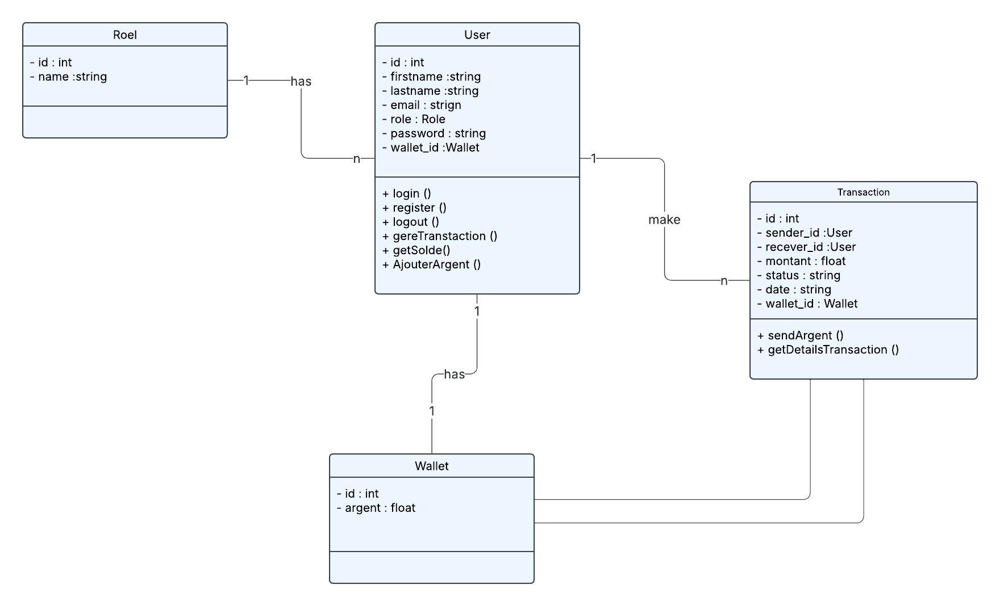

# OnlineWallet API Documentation

This is a RESTful API for an online wallet that allows users to securely exchange money between accounts, with a particular focus on transaction security and protection of personal data.

## Features
- User registration and authentication
- Wallet management
- Money transfers between users
- Transaction history
- Balance inquiries
- Secure API with token-based authentication

## Class Diagram
   

---

## Technical Stack
- **Backend:** Laravel9 
- **Database:** MySQL
- **Authentication:** Laravel Sanctum
- **Security:** Hashed passwords, secure transactions
- **Postman:** postman

## 📚 API Documentation 
  
### Authentication 

| Endpoint         | Method | Description          |  Arg                                             |
|------------------|--------|----------------------|--------------------------------------------------| 
| `/api/register`  | POST   | Register a new user  |  name,lastname, email, password, role_id, argent |                                                                
| `/api/login`     | POST   | Authenticate a user  |  email, password                                 |
| `/api/logout`    | POST   | Logout a user        |                                                  |

---
### Wallet Management 

| Endpoint              | Method | Description          |  Arg              |
|-----------------------|--------|----------------------|-------------------| 
| `/api/getSolde/{id}`  | GET    | Get user balance     |  id               |                                                                
| `/api/ajouterArgent`  | POST   | Add money to wallet  |  email, argent    |
---
### Transactions 

| Endpoint                           | Method | Description                   |  Arg                                      |
|------------------------------------|----------------------------------------|-------------------------------------------| 
| `/api/sendArgent`                  | POST   | Transfer money between users  |  sender (email), recever (email), montant | 
| `/api/getDetailsTransaction/{id}`  | GET    | Get Details Transaction       |  id |                                                              
---

## Models

### User
Represents a user of the system  
**Attributes**:  
- `id`: Unique identifier for the user  
- `name`: First name of the user  
- `lastname`: Last name of the user  
- `email`: Email address of the user  
- `password`: User's password  
- `role_id`: The role assigned to the user  
- `wallet_id`: The user's wallet ID  

**Relationships**:    
- Belongs to `Wallet`
- Has many `Transactions`

---

### Wallet
Represents a user's financial account  
**Attributes**:  
- `id`: Unique identifier for the wallet  
- `argent`: Balance in the wallet  

**Relationships**:  
- Has one `User`

---

### Transaction
Represents a money transfer between users  
**Attributes**:  
- `id`: Unique identifier for the transaction  
- `sender_id`: ID of the user who sent the money  
- `recever_id`: ID of the user who received the money  
- `montant`: Amount of money transferred  
- `status`: Status of the transaction (e.g., completed, pending)  
- `date`: Date and time of the transaction  

**Relationships**:  
- Belongs to `User` (sender)  
- Belongs to `User` (receiver)

---

## Error Handling

The API returns appropriate HTTP status codes and error messages:

- **200 OK**: Successful operation  
- **400**: Bad request   
- **401**: Unauthorized   
- **404**: Resource not found  
- **500**: Server error
